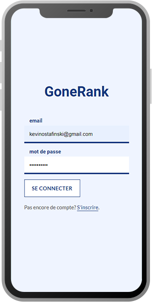
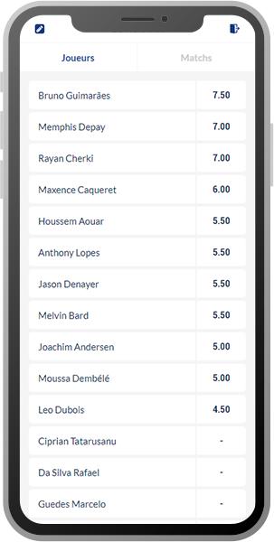
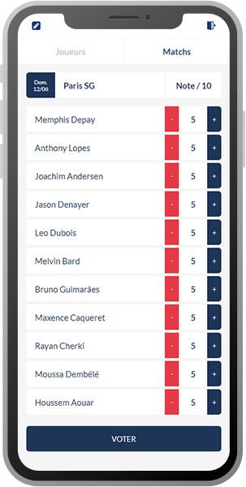

# GoneRank [LIVE DEMO](https://gonerank.herokuapp.com)

GoneRank is a FullStack App built for OL fans desiring to rate the performances of their players during the season. 

  

   

The main Goal is to establish a realistic Performance Ranking based on opinions of true club supporters, and avoid the ones made by biased media sources.

The logic can be reused for any team/sport.

### 1. Built with:

- React
- Node (Express)
- GraphQL (Apollo Server & Apollo Client)
- MongoDB (Atlas & mongoose)
- styled-components

### 2. Additional informations:

- authentication flow (login & registration)
- token encoding (JWT) & password hashing (bcrypt)
- test suite with Jest and React Testing-Library
- app hosted by Heroku

### 3. Usage (from root):

- `yarn client-install` - installs client dependencies
- `yarn dev` - starts app in development mode
- `yarn start` - starts node server
- `yarn server` - starts dev server with nodemon
- `yarn client` - starts client app
- `yarn heroku-postbuild` - script for heroku's deployment flow

### 4. Environment:

To run this app you need to setup a MongoDB Atlas project.

Its also required to add the environment variables below to an `.env` file or your heroku setup:
- `MONGO_URI=mongodb+srv:/USERNAME:PASSWORD@XXXXX` - uri connecting your app to DB, provided by MongoDB Atlas project.
- `JWT_SECRET_KEY=XXXXX` - your secret key for Json Web Token encoding/decoding.
